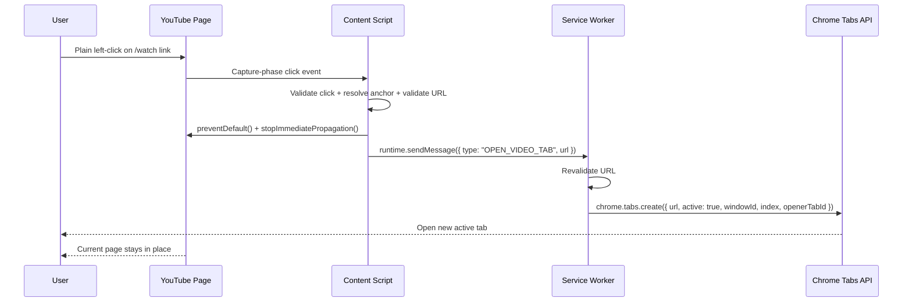

# Architecture: YouTube in New Tab

## Overview
The extension uses the smallest practical MV3 architecture:

- A static content script for `https://www.youtube.com/*`
- A service worker that owns `chrome.tabs.create()`
- A toolbar popup with one global enable or disable toggle
- `chrome.storage.sync` as the shared state layer

This keeps the permission surface small and fits the interaction model cleanly.

## Event Flow



## Why This Shape

### Content script
- Owns DOM event handling.
- Reads the `enabled` setting from `chrome.storage.sync`.
- Reacts to `chrome.storage.onChanged` so popup changes apply immediately.
- Never tries to use `chrome.tabs` directly.

### Service worker
- Owns privileged extension APIs that are not available in the content script.
- Validates the incoming URL before opening a new tab.
- Inserts the tab at `sender.tab.index + 1` so it appears beside the current tab instead of at the end of the tab strip.
- Returns a small debug response so failures can be diagnosed.

### Popup
- Exposes the only v1 preference: enable or disable interception.
- Reads and writes the same `chrome.storage.sync` key as the content script.

## Public Interfaces

### Runtime message
```js
{ type: "OPEN_VIDEO_TAB", url: string }
```

### Stored settings shape
```js
{ enabled: boolean }
```

Default:

```js
{ enabled: true }
```

## Manifest Strategy

### Included
- `manifest_version: 3`
- `permissions: ["storage"]`
- `background.service_worker`
- `action.default_popup`
- `content_scripts` for `https://www.youtube.com/*`
- `run_at: "document_start"`

### Intentionally excluded
- `"tabs"` permission
- `host_permissions`
- `scripting`
- `webRequest`
- `declarativeNetRequest`
- options page

`content_scripts.matches` already scopes the extension to YouTube. Adding broader permissions would make the extension noisier without helping this feature.

## SPA Considerations
- YouTube is a single-page app and frequently replaces feed sections without full reloads.
- A single delegated listener on `document` survives those changes because it does not depend on individual tiles or thumbnails being present at injection time.
- No `MutationObserver` is needed in v1.

## Interception Rules
- Only plain primary-button clicks
- Ignore events with `Ctrl`, `Cmd`, `Shift`, or `Alt`
- Ignore links already targeting `_blank`
- Only same-origin `https://www.youtube.com/watch?...` links
- Require the `v` query parameter
- Ignore everything else

This preserves familiar browser behaviors like `Cmd`-click, `Ctrl`-click, middle-click, and context-menu open-in-new-tab.

## Graceful Failure Strategy
- The content script cancels navigation only after confirming the URL is in scope.
- If runtime messaging fails for any reason, the content script falls back to `window.location.assign(url)` so the user click still does something useful instead of becoming a dead interaction.

## File Tree

```text
.
├── manifest.json
├── service-worker.js
├── content.js
├── icons
│   ├── icon-16.png
│   ├── icon-32.png
│   ├── icon-48.png
│   ├── icon-128.png
│   └── icon.svg
├── popup.html
├── popup.css
├── popup.js
├── task_plan.md
├── findings.md
├── progress.md
└── docs
    ├── architecture.md
    ├── implementation.md
    ├── research.md
    ├── tasks.md
    └── test-plan.md
```

## Rejected Patterns

### DOM selectors tied to YouTube cards
- Too brittle.
- Likely to break as soon as YouTube changes markup.

### Per-link listener registration
- Too much maintenance for a SPA feed.
- Harder to reason about than one delegated listener.

### Background mode in v1
- Changes the expected interaction model.
- Better treated as a future preference once the core behavior is stable.
